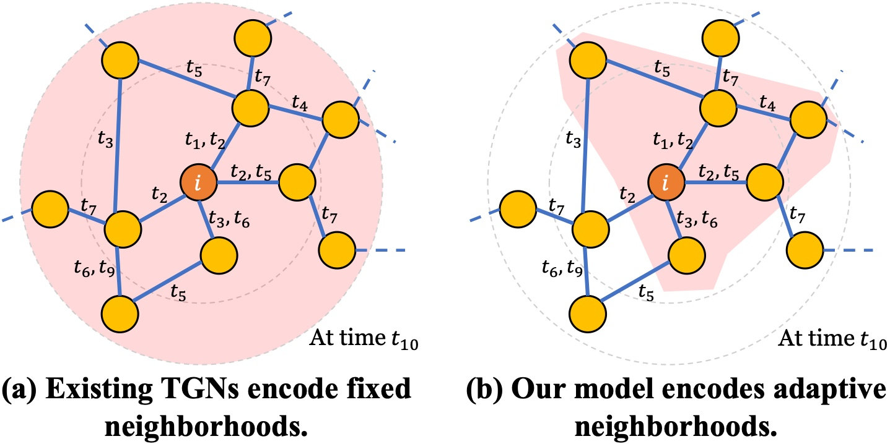
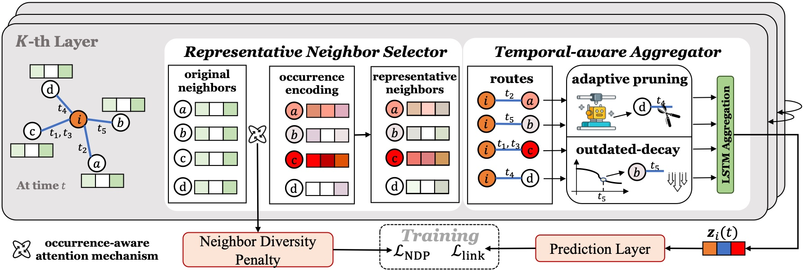

# KDD2024 SEAN

This is the official implementation for KDD 2024 Research Track Full Paper: **Towards Adaptive Neighborhood for Advancing Temporal Interaction Graph Modeling**

We have provided the related resources here: [[📃 Paper](https://dl.acm.org/doi/10.1145/3637528.3671877 )]  [[🎬 Video](https://www.youtube.com/watch?v=SzsbqVgxfqg )] 
!![Overview]</img>

If you make advantage of SEAN in your research, please cite the following in your manuscript:
```
@inproceedings{zhang2024towards,
  title={Towards Adaptive Neighborhood for Advancing Temporal Interaction Graph Modeling},
  author={Zhang, Siwei and Chen, Xi and Xiong, Yun and Wu, Xixi and Zhang, Yao and Fu, Yongrui and Zhao, Yinglong and Zhang, Jiawei},
  booktitle={Proceedings of the 30th ACM SIGKDD Conference on Knowledge Discovery and Data Mining},
  year={2024},
  organization={ACM}
}
```

 ## Paper Intro
**Contribution 1: a novel method for addressing the weaknesses of existing TGNs.**

* Existing TGNs: fixed, hand-crafted rules for neighborhood encoding that indiscriminately encodes the pre-defined hops of neighborhoods.
* **SEAN**: adaptive, flexible neighborhood encoding mechanism that obeys both personalization and temporal awareness for generating more expressive representations.

</img>

Representative Neighbor Selector can empower the model to pinpoint the important neighbors, who then act as the personalized representatives for the target node. Meanwhile, we propose the neighbor diversity penalty to penalize the over-concentration of these neighbors. Furthermore, we conduct our Temporal-aware Aggregator, which synthesizes neighborhood aggregation by selectively determining the utilization of aggregation routes and decaying the outdated information.

**Contribution 2: a new financial transaction TIG benchmark dataset for temporal interaction graph community.**

In this paper, we release **TemFin**, a new temporal interaction graph benchmark dataset that records the financial transfer transactions between bank accounts.


## Use TemFin and Run SEAN

### TemFin
You can download the data from here. Put the `TemFin.csv` file in `./raw_data` and run the following command:
```
python preprocess_data.py --data TemFin
```
If you want to run on your own datasets, you have to convert your own data into our format, and run `preprocess_data.py` for your reference.

### SEAN for TIGE

We integrate our SEAN into [TIGE](https://github.com/yzhang1918/www2023tiger ), and for the Temporal Link Prediction task, please run:

```
train_self_supervised.py --data [DATA] --seed 0 --gpu 0
```

